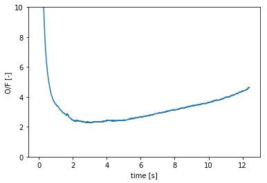
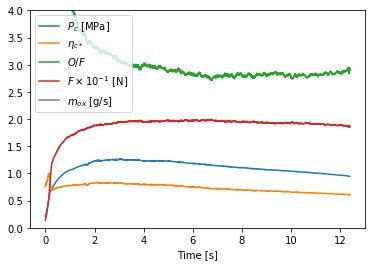

# HyRockCom_Anly

This program is "Re-Construction Technique" for data reduction or hybrid rocket firing test. This program calculates and exports an oxidizer to fuel ratio, O/F, history from experimetntal data: chamber pressure history, oxidizer mass flow rate history, (thrust history) and total fuel mass consumption.  

本プログラムは”再現法”という，ハイブリッドロケットの燃焼実験データ解析プログラムであり，燃焼室圧力履歴，酸化剤流量履歴，（計算モードによっては推力履歴），および燃料消費量といった実験データを用いることで，酸燃比のO/Fの履歴を計算によって取得する事ができる．

※ windows, python 3 に対応  
※ 必要なpythonパッケージは適宜入れてください（不親切ですいません）

## 1. What "CEA-DB_Maker" Can Do for You

>It is very important to obtain O/F history on hybrid rocket research in order to estimate instant fuel regression rate. However, generally speaking, we can not obtain O/F histoy directoly as measurements, because it is very difficult to measure fuel mass flow rate of hybrid rocket motor. Re-construction enable to obtain the O/F history from experimental data.  
>
>ハイブリッドロケットにおいてO/F履歴を取得することは，燃料後退速度の瞬時値を得るために非常に重要である．しかしながら，燃料流量を直接計測することが困難であるため，一般的にO/F履歴を測定値として得ることはできない．再現法は得られた他のデータを利用することでO/F履歴の取得を可能にした．  

当研究室では再現法を5種類に分類しており，本プログラムでは基本的な3種　"RT-1", "RT-3", "RT-5" を実行できる．各手法で出来ることを以下に示す．  

**RT-1**  
燃焼中の特性排気速度c*を一定として，O/F履歴と燃料流量履歴を算出する  

* 出力：O/F履歴，燃料流量履歴，平均c*
* 入力：燃焼室圧力履歴，酸化剤流量履歴，燃料消費量，ノズルスロート径
* 仮定：c*一定，c*効率=1.0，ノズルエロージョン無視

**RT-3**  
O/F履歴，燃料流量履歴，特性排気速度c*履歴，特性排気速度効率履歴を算出する  

* 出力：O/F履歴，燃料流量履歴，c*履歴，特性排気速度効率履歴
* 入力：燃焼室圧力履歴，酸化剤流量履歴，推力履歴，燃料消費量，ノズルスロート径，ノズル拡大比
* 仮定：ノズル効率一定，ノズルエロージョン無視

**RT-5**  
燃焼中の特性排気速度効率を一定として，O/F履歴，燃料流量履歴，特性排気速度c*履歴を算出する  

* 出力：O/F履歴，燃料流量履歴，c*履歴，平均特性排気速度効率
* 入力：燃焼室圧力履歴，酸化剤流量履歴，燃料消費量，ノズルスロート径
* 仮定：特性排気速度効率一定，ノズルエロージョン無視

  

  

また，誤差解析機能もついており各入力値の誤差を指定すれば，出力されるO/F履歴，燃料流量履歴の誤差も計算可能である．

## 2. Quick Start

すべきことはほとんどないが，実行前の準備に関して解説する．

* 日本語　(coming soon)
* English (coming soon)

## 3. Users Guide

実際の実行手順に関して解説する．

* [日本語](docs/users_guide_jp.md)
* English　（coming soon)

## 4. API Document

モジュールに実装した各メソッドについてのドキュメント (Coming soon)

## 5. Calculation Method  

本手法の理論について記述した論文等

* [Nagata et. al., "Evaluations of Data Reduction Methods for Hybrid Rockets", 65th IAC, 2014.](docs/reference/ref1.pdf)
* [Nagata et. al., "Accuracy and applicable range of a reconstruction technique for hybrid rockets", Advances in Aircraft and Spacecraft Science, Vol.1, No.3, pp273-289.](http://www.techno-press.org/content/?page=article&journal=aas&volume=1&num=3&ordernum=2)

各手法の計算フローや利用している数式の説明

RT-1　　(coming soon)  
RT-3　　(coming soon)  
RT-5　　(coming soon)  
