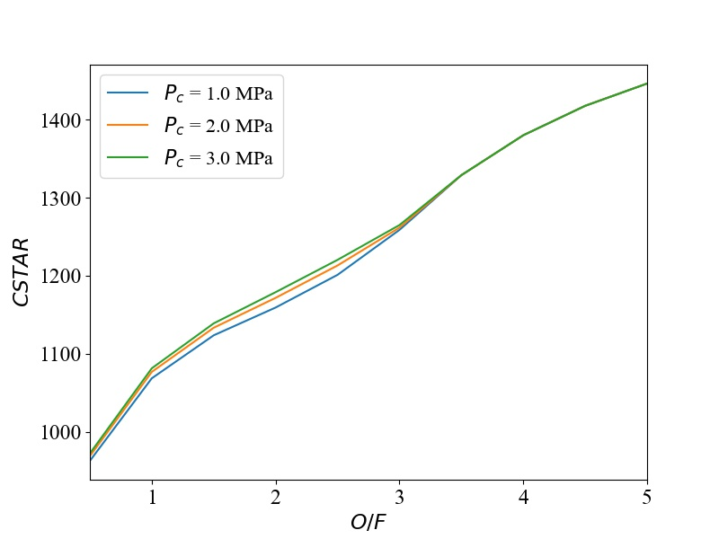
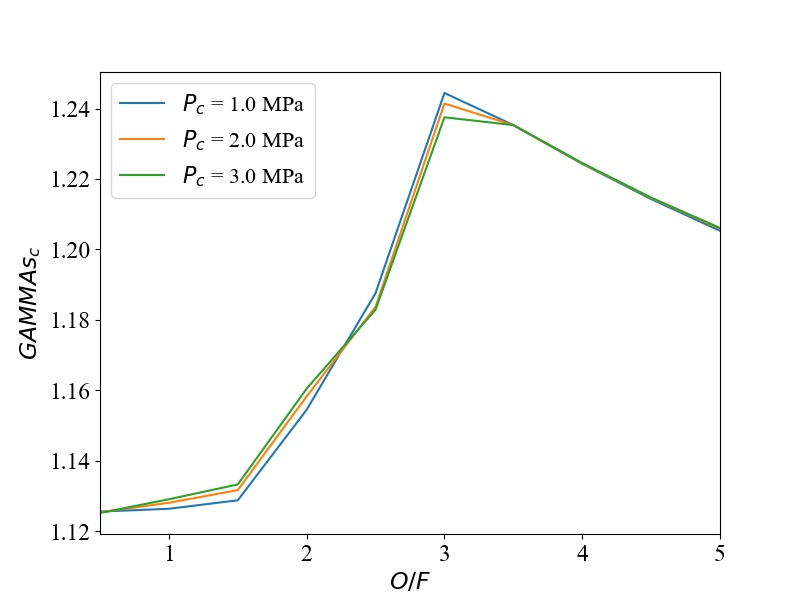
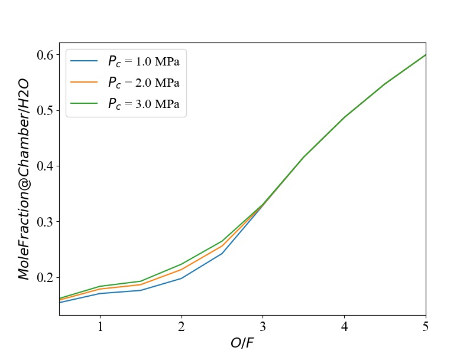

# CEA-DB_Maker
This program makes the DataBase of the result calculated by NASA-CEA rocket problem mode  
NASA-CEAをrocketモードで実行した結果をデータベース化し，さらにそこから値を呼び出したりするプログラム  
※ windows,Ubuntu,macOS python 3 に対応  
※ 必要なpythonパッケージは適宜入れてください（不親切ですいません）

## 1. What "CEA-DB_Maker" ?　 
"CEA-DB_Maker"で出来ることを下記に示す．  
* 複数の燃焼室圧力PcとO/Fの条件に対する，熱力学，ロケット性能，熱輸送パラメータを各パラメータ毎にcsvファイルにデータベース化  
* 複数の燃焼室圧力PcとO/Fの条件に対する，燃焼生成物(MoleFraction)を，各生成物毎にcsvファイルにデータベース化  
* 作成したデータベースを基に，各パラメータとPc,O/Fとの関係をグラフとして出力  

**特性排気速度 c***   
  

**燃焼室における比熱比**   
  

**燃焼室におけるH2Oのモル分率**   

他にも，下記のようなメソッドを提供する  
* 複数の燃焼室圧力とO/Fの条件に関して.inpファイルを大量生成
* CEAのシングル実行
* .outファイルからパラメータの読み出し返す  
* データベースを基に，任意の燃焼室圧力とO/Fに対するパラメータの補間値を返す関数の生成

## 2. Quick Start 
すべきことはほとんどないが，実行前の準備に関して解説する．
* 日本語　(coming soon)
* English (coming soon)

## 3. Users Guide
実際の実行手順に関して解説する．
* [日本語](docs/users_guide_jp.md) 
* English　（coming soon）

## 4. API Document
モジュールに実装した各メソッドについてのドキュメント (Coming soon)
