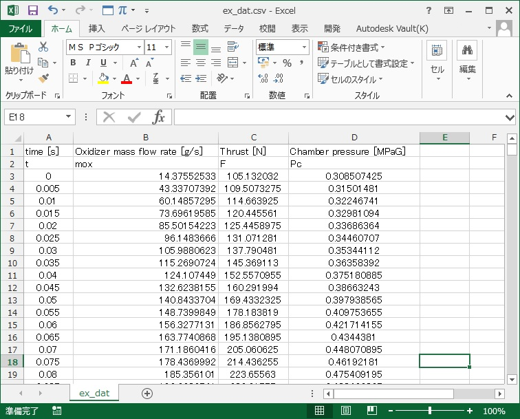
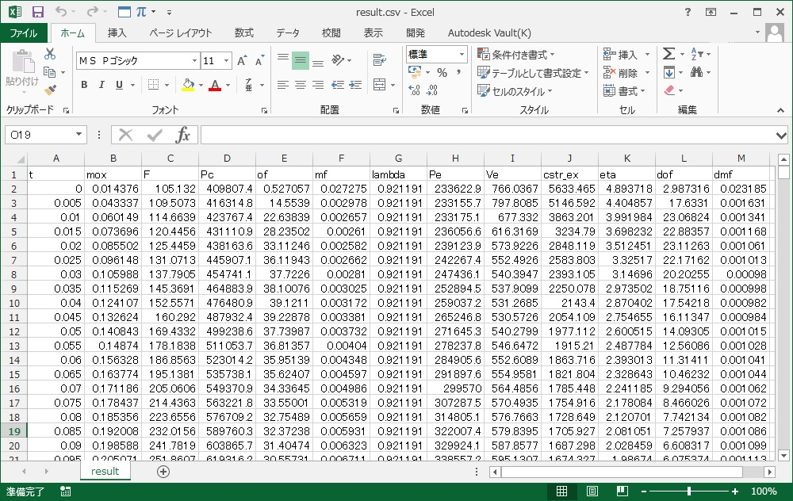
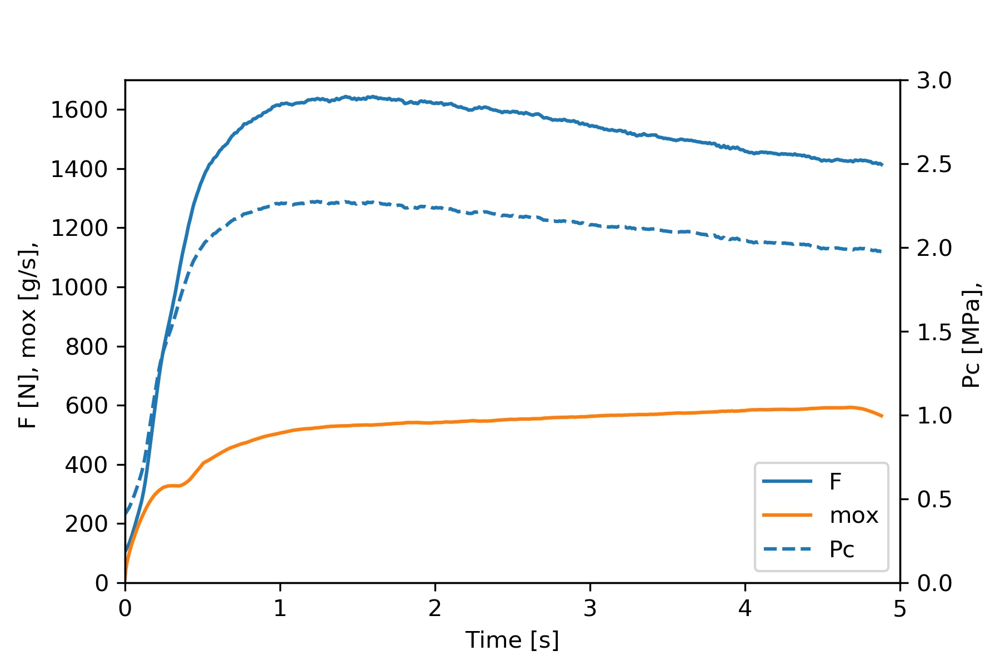
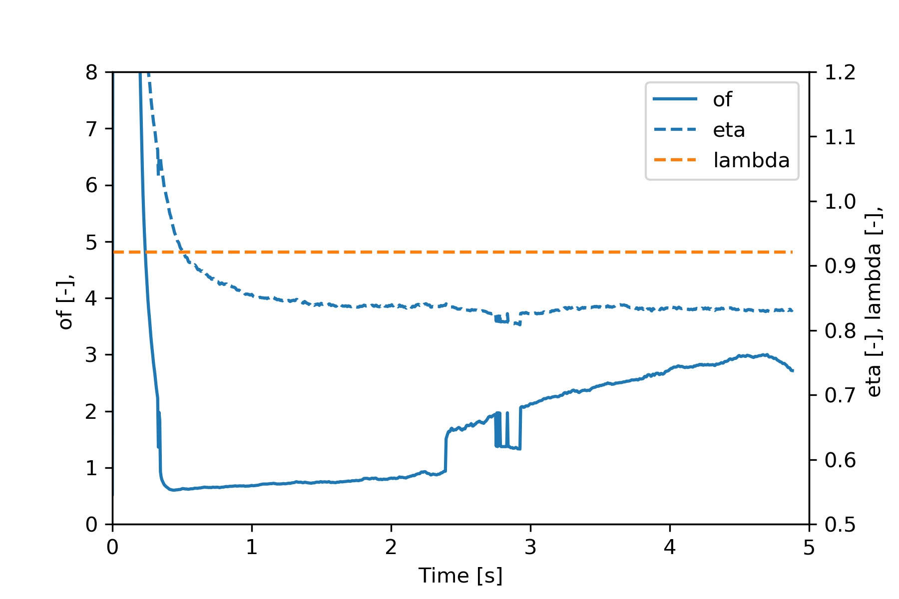

# 1. 事前準備

* 燃焼室圧力(ゲージ)[MPa]と酸化剤流量[g/s]，場合によっては推力[N]の計測値を用意する．単位系に気をつけてExcleなどで整理しておくと楽．
* データは，燃焼室圧力が立ち上がった時を燃焼開始とみなして時刻0とし，酸化剤の供給が完了した時を燃焼終了とみなして以降のデータを除去したものを用いる．

* 実験データや出力されるファイルを格納するための解析用フォルダを```exp_dat/```下に作成する．名前は任意のものでよいが，実験名をつけるとわかりやすい．今回は```TEST```フォルダを作成．

```
HyRockCom_Anly_cui.py  
...  
exp_dat/  
  ┗ TEST
```

# 2. 実行手順

## 2.1 燃焼実験データの入力，指定  

* "HyRockCom_Anly_cui.py" を実行  
* 作成した解析用フォルダ名を入力

~~~
Input a Experiment Name (The Name of Folder Containing Experiment Data in "exp_dat" folder)
>>TEST
~~~

* 燃焼実験データのcsvファイル```ex_dat.csv```をまだ用意していないため，テンプレートファイル作成を選択．

~~~
There is no such a experiment data
c:\~~~~~~\hyrockcom_anly\exp_dat\TEST\ex_dat.csv

Do you want to make a template file ?
  y/n ?
>>y
~~~

~~~
Complete to generate a template file.
Please input the experimental data.
Please aboid using any negative values and data that has vivration with time
~~~

* 解析用フォルダ(今回は```TEST```)下に，燃焼実験データを書き込む```ex_dat.csv```が生成される

```
HyRockCom_Anly_cui.py  
...  
exp_dat/  
  ┗ TEST/
      ┗ex_dat.csv
```

* Excle等で開いて実験データを単位系や時刻などに注意して以下の様に流し込み，保存する．(推力データがない場合は全て０で埋める．)



※ 本チュートリアルで使用するデータは```sample```フォルダにあるので，実験データはないが試しに計算してみたい方は，そちらの```ex_dat.csv```ファイルをコピペしてください．

* 再度，解析用フォルダの名前を入力する．

```
Input a Experiment Name (The Name of Folder Containing Experiment Data in "exp_dat" folder)
>>TEST
```
## 2.2 解析条件・実験条件の入力

* 使用する手法を選択する．　(RT-1 or RT-3 or RT-5) 今回はRT-3を選択

~~~
Select calculation mode.
 1: RT-1; assuming c* is constant
 3: RT-3; assuming nozzle discharge coefficient is constant; lambda1
 5: RT-5; assuming c* efficiency is constant. RT-2 improved with initial O/F
>>3
~~~

* ノズルスロート径を指定

~~~
Input nozzle throat diameter [mm]
>>27
~~~

* ノズル拡大比を指定

~~~
Input nozzle expansion ratio
>>1.0
~~~

* 燃料消費量を指定

~~~
Input fuel consumption [g]
>>2031
~~~

## 2.3 誤差解析に必要なデータ入力

* 誤差解析を実行するか選択　(実行しない "n" の場合，本節の以降の操作は不要で，次節の操作に移る)

~~~
Do you want to execute error analisys?
  y/n ?
>>y
~~~

* 燃焼室圧力を取得した圧力センサの誤差を指定する．

~~~
Input error of pressure sensor wihch measures chamber pressue [MPa]
>>0.054
~~~

* 酸化剤流量の誤差を指定する．

~~~
Input error of oxidizer mass flow rate [g/s]
>>0.142
~~~

* 燃料消費量の誤差を指定する．

~~~
Input error of fuel mass consumption [g]
>>0.1
~~~

* ノズルスロート径の誤差を指定する．

~~~
Input error of nozzle throat diameter [mm]
>>0.1
~~~

* ロードセルの誤差を指定する．（本項目は，RT-1, 5においては要求されない）

~~~
Input error of load cell which measures thrust [N]
>>20.5
~~~

## 2.4 使用するCEAデータベースの指定

* CEAデータベースのフォルダ名を指定する．(今回はデータベースが"LOX_PE"というフォルダに格納されていると仮定) 

~~~
Input the Folder Name Containing Results of CEA in "cea_db" folder
>>LOX_PE
~~~

```
HyRockCom_Anly_cui.py  
...  
exp_dat
cea_db_maker/  
  ┗ cea_db/
      ┗LOX_PE
```

* 該当するデータベースが存在しない場合，データベースの作成を行う

~~~
Do you want to make a dataset of CEA result ?
  y/n
>>y
~~~

データベース作成を行う場合は "cea_db_maker"リポジトリの[Users Guide](../cea_db_maker/docs/users_guide_jp.md)を参考に進める．  
今回使用した　”LOX v.s. PE”　のデータベース作成条件は下記の通り．  

|項目|値|
|:--|--:|
|計算条件|ノズル凍結流|
|酸化剤|O2(L)|
|酸化剤質量分率[%]|100|
|酸化剤温度[K]|90|
|燃料|PE|
|燃料質量分率[%]|100|
|燃料温度[K]|273|
|燃料標準生成エンタルピ[kJ/mol]|-54.3|
|燃料組成|C 2 H 4|

* データベースの作成が完了すると自動的に再現法の実行が始まる．

## 2.5 実行中の様子

### 2.5.1 再現法本体の実行

再現法本体の計算が最初に実行される

※1：フィッティングパラメータを色々と振って，計算で予測される燃料消費量と実際の燃料消費量との誤差(Erro of Mf)が，ある値以下に小さくなるまで反復計算(iteration)が実行される．  
※2：フィッティングパラメータはプログレスバー上部の値であり，Rt-3はノズル効率lambda，RT-5は特性排気速度効率etaをフィッティングパラメータとしている．
※3：最終的に収束したフィッティングパラメータは，平均ノズル効率や平均特性排気速度効率として出力される．
※4：RT-3はRT-5を一度実行後に行うため倍の時間がかかる

~~~
Now executing RT calculation. Please wait.
1st iteration
eta = 0.8
100%|████████████████
Error of Mf = -29.27578069525622 [%]

2nd iteration
eta = 0.80018
100%|███████████████████
Error of Mf = -29.23021416723426 [%]

......
~~~

### 2.5.2 誤差解析の実行

誤差解析機能を有効とした場合，引き続き誤差解析の計算が実行される．

※1：各入力パラメータ毎に再現法が実行され誤差解析を行うため，誤差解析なしの場合に比べ4~5倍の時間がかかることに注意

~~~
Now analyzing oxidizer mass flow rate error...
1st iteration
eta = 0.8
100%|██████████████████
Error of Mf = 7.681634749371148 [%]

2nd iteration
eta = 0.80018
100%|███████████████████████
Error of Mf = 8.289038683616551 [%]

.......
~~~

## 2.6 出力結果

* 以下のように，完了のメッセージが出力されると無事計算に成功している（はず）

~~~
4th iteration
lambda = 0.9204976746828022
100%|█████████████████
Error of Mf = 0.2612535419006148 [%]


RT Calculation was successfully finished!
~~~

* 解析フォルダ下（今回は```exp_dat/TEST```）に計算結果である```result.csv```ファイルが出力されている．

```
HyRockCom_Anly_cui.py  
...  
exp_dat/  
  ┗ TEST/
      ├ ex_dat.csv
      ├ cond.json
      ┗result.csv
```

* Excel等で開くと，解析結果を閲覧することが出来る．

  

* ```result.csv```ファイル内の各パラメータの列名と単位は以下の通り．(基本的にSI単位)

|Parameter|Symbol|Unit|
|:--|--:|:--|
|酸化剤流量|mox|kg/s|
|推力|F|N|
|燃焼室圧力|Pc|Pa|
|O/F|of|-|
|燃料流量|mf|kg/s|
|ノズル効率|lambda|-|
|ノズル出口圧力|Pe|Pa|
|有効排気速度|Ve|m/s|
|特性排気速度(実験値)|cstr_ex|m/s|
|特性排気速度(理論値)|cstr_th|m/s|
|比熱比|gamma|-|
|特性排気速度効率|eta|-|
|O/F誤差|dof|-|
|燃料流量誤差|dmf|-|

* "HyRockCom_Anly_cui.py" 中のクラス```Plot```を利用するとグラフの出力も可能  

  

  

# Tips

計算が発散したとき，結果がおかしい場合などに有効な対処方法を以下に紹介する．  

* 燃焼実験データの単位系が指定されたものと合致するか確認する．
* 燃焼実験データにノイズが多い場合は，移動平均などで平滑化を行う．
* 燃焼実験データに負値や空データ，空列が混入していないか確認し，ある場合は除去する．
* 燃焼実験データの燃焼開始時刻を，燃焼室圧力が定常値の80~90％となった時に修正する．
* 燃焼実験データの燃焼終了時刻を，燃焼室圧力または酸化剤流量が定常値の80~90%となった時に修正する．
* 出力されたO/Fが，用いたしたCEAデータベースのO/Fの範囲を大幅に超えていないか確認し，必要であればO/Fの範囲を拡大したデータベースを作成し直す．（燃焼初期の高O/F領域などは例外）
* O/F履歴が滑らかでなく飛び飛びの履歴を取る場合があるがこれは多重解問題であり，計算結果がおかしいわけではなく再現法は正しく実行されている．ただし，得られたO/F履歴は実際とは異なっているため，今後の改善が望まれる．多重解問題の詳細は論文等を参考にされたい．
